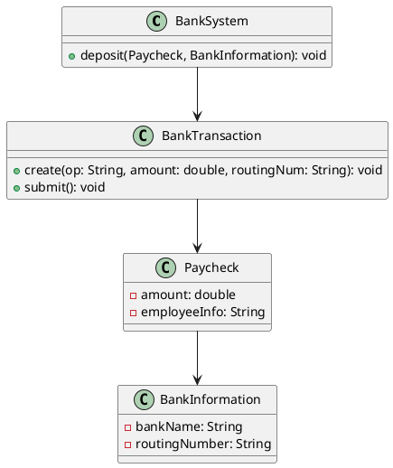
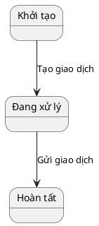
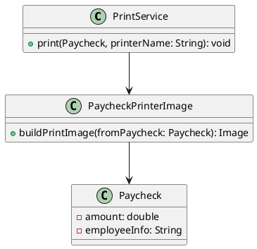
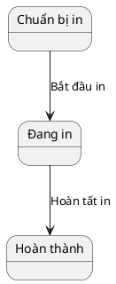
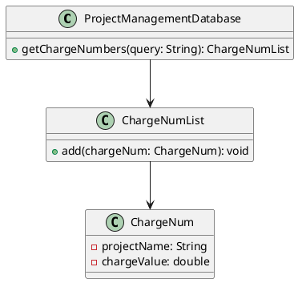
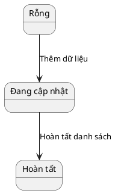
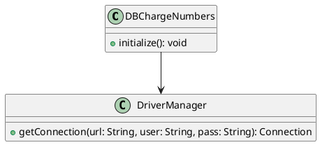
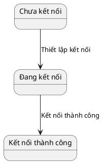

# Thiết Kế Lớp - Hệ Thống Payroll System

## 1. BankSystem::deposit

### **Phân tích chi tiết**

#### **Lớp và thuộc tính**:
- **BankSystem**: Đại diện hệ thống ngân hàng.
- **BankTransaction**: Quản lý giao dịch.
- **Paycheck**: Đại diện bảng lương, chứa số tiền và thông tin nhân viên.
- **BankInformation**: Thông tin ngân hàng (tên, số định tuyến).

#### **Phương thức (operations)**:
- `BankSystem.deposit(Paycheck, BankInformation)`
- `BankTransaction.create(op, amount, routingNum)`
- `BankTransaction.submit()`

#### **Biểu đồ lớp (Class Diagram)**:

#### **Biểu đồ trạng thái (State Diagram)**:

---

## 2. PrintService::print

### **Phân tích chi tiết**

#### **Lớp và thuộc tính**:
- **PrintService**: Quản lý việc in.
- **PaycheckPrinterImage**: Tạo hình ảnh in từ bảng lương.
- **PrinterInterface**: Kết nối với máy in.
- **Employee**: Thông tin nhân viên.

#### **Phương thức (operations)**:
- `PrintService.print(Paycheck, String)`
- `PaycheckPrinterImage.buildPrintImage(fromPaycheck)`

#### **Biểu đồ lớp (Class Diagram)**:

#### **Biểu đồ trạng thái (State Diagram)**:

---

## 3. ProjectManagementDatabase::getChargeNumbers

### **Phân tích chi tiết**

#### **Lớp và thuộc tính**:
- **ProjectManagementDatabase**: Đại diện hệ thống cơ sở dữ liệu.
- **ChargeNumList**: Danh sách số tính phí.
- **ChargeNum**: Đối tượng số tính phí, chứa tên dự án và giá trị.

#### **Phương thức (operations)**:
- `getChargeNumbers(String): ChargeNumList`
- `ChargeNumList.add(theChargeNum)`

#### **Biểu đồ lớp (Class Diagram)**:

#### **Biểu đồ trạng thái (State Diagram)**:

---

## 4. ProjectManagementDatabase::initialize

### **Phân tích chi tiết**

#### **Lớp và thuộc tính**:
- **DBChargeNumbers**: Kết nối cơ sở dữ liệu.
- **DriverManager**: Quản lý kết nối.

#### **Phương thức (operations)**:
- `initialize()`: Thiết lập kết nối.
- `getConnection(url, user, pass): Connection`

#### **Biểu đồ lớp (Class Diagram)**:

#### **Biểu đồ trạng thái (State Diagram)**:

---

